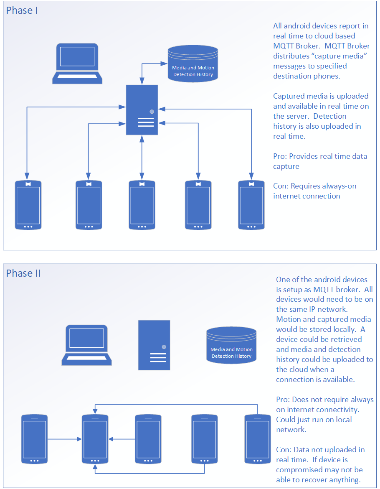

# Base Station

The base station is composed of two components a user interface and a run time.

## User Interface
The user interface will let you create groups of android devices that will make up your sensor network. 
It also allows you to view the media captured by devices.  Please watch the following video for more information

[Video of the Base Station](https://www.youtube.com/watch?v=vRtTBfIpvDA)

## Run Time
The runtime is our cloud based application that facilitates communications between the android devices.  The runtime hosts an MQTT broker
that will listen and forward messages between devices.  The runtime also fills the role of being an endpoint where media can be uploaded 
so it can be reviewed at a later time.

