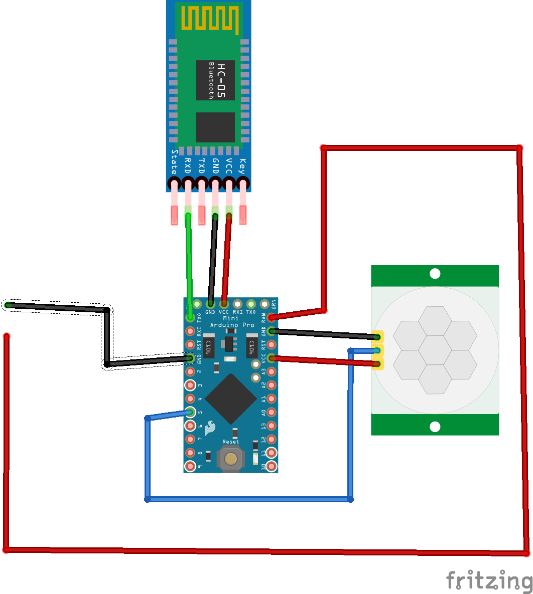

# External Sensors
Although we are using vibration, audio and video detection from the phone there may be some cases where an external sensor will improve effectiveness.

This page will discuss that external sensor, how it can relatively easily be built and how it can be extended.

# Overview
We chose the option of simplicity for creating our external sensors, the core consists of an Arduino Pro Mini, and an HC-05 bluetooth module as well as
a power source which can simply be a cell phone charging battery pack.  A complete cost for building a sensor pack should be less than $30 which entirely consists of standard parts you can obtain from Amazon.
and only requires connecting a few wires.  For our demo we chose to use a simple PIR detection module, however based on needs this could 
easily be extended.  Once you have built your sensor module you simply need to download the Arduino Sketch and pair it with your phone.  
To build the initial version took us less than 1 hour.  If you have a little experience with Arduino's you should be able to create additional modules in less than 30 minutes.

### Shopping Lists
1. [Arduino Pro Mini (3.3V)](https://www.amazon.com/HiLetgo-Atmega328P-AU-Development-Microcontroller-Bootloadered/dp/B00E87VWQW/ref=sr_1_1_sspa?ie=UTF8&qid=1540403147&sr=8-1-spons&keywords=arduino+pro+mini+3.3v&psc=1)
1. [USB Cable](https://www.amazon.com/Android-COVERY-Charging-Samsung-Motorola/dp/B07F9LWQTM/ref=sr_1_6?ie=UTF8&qid=1540403178&sr=8-6&keywords=USB+Cable&dpID=51YH%252BgthZaL&preST=_SY300_QL70_&dpSrc=srch) - Just need to make it easy to connect to battery pack.
1. [HC-05 Bluetooth Module](https://www.amazon.com/HiLetgo-Wireless-Bluetooth-Transceiver-Arduino/dp/B071YJG8DR/ref=sr_1_1_sspa?ie=UTF8&qid=1540403217&sr=8-1-spons&keywords=HC-05&psc=1)
1. [PIR Sensor](https://www.amazon.com/DIYmall-HC-SR501-Infrared-Sensor-Arduino/dp/B07CSM3K63/ref=sr_1_10?s=industrial&ie=UTF8&qid=1540403253&sr=1-10&keywords=PIR+Sensor)
1. [Jumper Wires](https://www.amazon.com/Elegoo-EL-CP-004-Multicolored-Breadboard-arduino/dp/B01EV70C78/ref=pd_bxgy_147_img_3?_encoding=UTF8&pd_rd_i=B01EV70C78&pd_rd_r=d03e2a3f-d7b4-11e8-8b2a-43f93729c796&pd_rd_w=Q6UF4&pd_rd_wg=qe7a6&pf_rd_i=desktop-dp-sims&pf_rd_m=ATVPDKIKX0DER&pf_rd_p=6725dbd6-9917-451d-beba-16af7874e407&pf_rd_r=W49VJ4N2NY4P7QWWVXAN&pf_rd_s=desktop-dp-sims&pf_rd_t=40701&psc=1&refRID=W49VJ4N2NY4P7QWWVXAN)
1. [Cell Phone Battery Pack](https://www.amazon.com/Anker-PowerCore-Lipstick-Sized-Generation-Batteries/dp/B005X1Y7I2/ref=sr_1_3_acs_ac_2?s=industrial&ie=UTF8&qid=1540403288&sr=1-3-acs&keywords=cell+phone+battery+charger) - Or similar
1. [Case](https://www.amazon.com/Ogrmar-Plastic-Dustproof-Junction-Enclosure/dp/B07875F7YZ/ref=sr_1_6?s=industrial&ie=UTF8&qid=1540403331&sr=1-6&keywords=Project+Case&dpID=31dQrW-ZJEL&preST=_SY300_QL70_&dpSrc=srch) - Similar or Could probably 3D print something

You will also need something to program the arduino
1. [Arduino FTDI Programmer](https://www.amazon.com/Sparkfun-Electronics-4446819-FTDI-Cable/dp/B00DJBNDHE/ref=sr_1_4?s=industrial&ie=UTF8&qid=1540403379&sr=1-4&keywords=arduino+ftdi+cable&dpID=41uimvvUC%252BL&preST=_SY300_QL70_&dpSrc=srch)

### Assembly Instructions
1. Create power cable - Simple cut the USB Micro end of the USB cable, strip the wires and just use the Red and the Black wires.
1. [Solder Pins to Arduino](https://www.youtube.com/watch?v=37mW1i_oEpA)
1. Connect the programmer to the arduino
1. Upload [software](https://github.com/bytemaster-0xff/plugs/tree/master/arduino/motiondetector) to [Arduino](https://www.arduino.cc/en/Guide/ArduinoProMini)
1. Using the female to female jumpers wires, connect Arduino to HC-05 as in the diagram below
1. Using the female to female jumpers wires, connect PIR to power cable and Arduino
1. Connect the red and black wires from the USB Cable above to the red and black wires in the diagram below.
1. Plug the USB cable into your battery pack
1. Pair your phone with the sensor.  Simply power up the external sensor, search for a new device with the name with the name HC-05 and use the PIN either 1234, if that doesn't work try 1234
1. Make sure you set the jumper on the PIR detector "Repeat Trigger"

*Note* - if you want to build more of these motion detectors you can use the AT command set of the HC-05 to give them unique PIN codes and names.  This is slightly more advanced and not necessary, this [article](http://www.martyncurrey.com/arduino-with-hc-05-bluetooth-module-at-mode/) gives you a little more information on how you could do that.

### Wiring Diagram

Any questions please contact [Kevin D. Wolf](mailto:kevinw@software-logistics.com)
