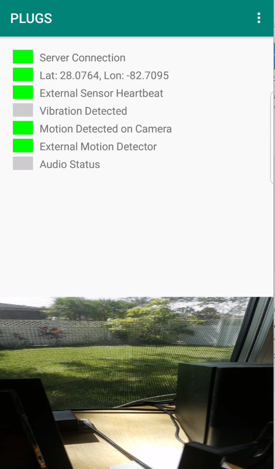
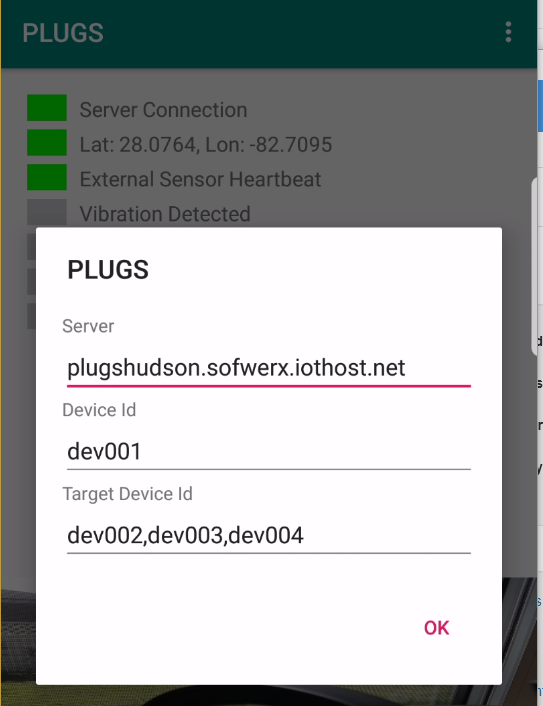
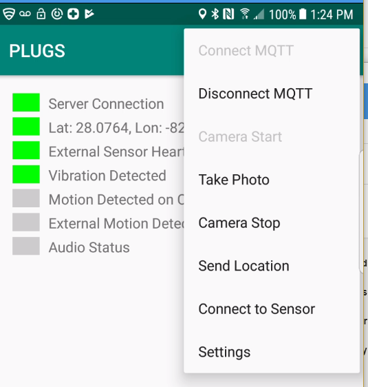
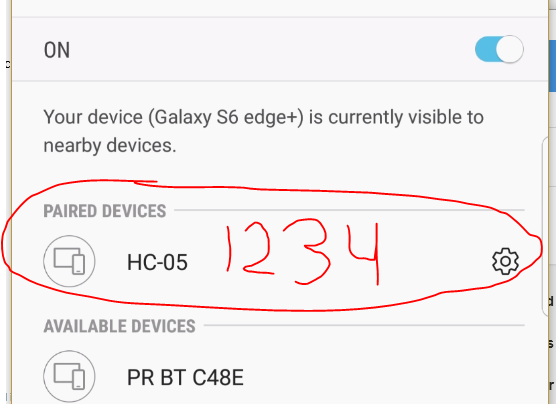

# PLUGS Mobile App

The PLUGS Mobile Application is an Android application written in Java with Android Studio. Currently we are targetting a minimum SDK version of 16 (Android 4.1). 

_note:_ The current version has a number of settings and things you can enable/disable.  It would be expected that the version that is fielded would simply startup in the proper configuration

## Primary Features
1. Detects Audio above a threshold
1. Detects Changes in Video w/ Camera
1. Detects Vibration with onboard accelerometer
1. Uses an external sensor via BlueTooth for [PIR detection](ExternalSensors.md)

[Video of Android PLUGS app](https://www.youtube.com/watch?v=R0mtmc-4-DA)

### Application Main (and only screen)

### Settings

* Server Id - Connect to MQTT Server (Cloud for Phase I, potentially android phone for Phase II)
* Configurable Device Id - Unique ID for this device, must be registered on the base station, it should be something like `dev002` containing only lower case letters and numbers.   This device also needs to be provisioned on the base station/server.
* Configurable Target Device Ids - List of other Unique Device IDs that should be triggered to capture media.  They should be comma delimitted like `dev001,dev003`

### Menu Options
*Important Note* In the version for Phase II that would be brought to the field, you would simply configure the settings for the application one time and then start the app.  In the final version you shouldn't need to do things like to connect to the server, start the camera and so on.  I think to gain a better understand of how the application works these menu items may help.

* Connect to MQTT - Establish connection with the server
* Disconnect to MQTT - Close connection with the server
* Camera Start - Start the camera and start detection of motion with video.
* Take Photo - This will force taking a picture with the camera and upload it to the server.
* Camera Stop - Stop the camera and motion dection with video
* Send Location - If the device has a location send it to the server
* Connect to Sensor - Establish Bluetooth Connect with [External Sensor](ExternalSensors.md)
* Settings - Show the settings screen.

### Bluetooth Connection

Connect your phone to the external Bluetooth sensor using the PIN code 1234

